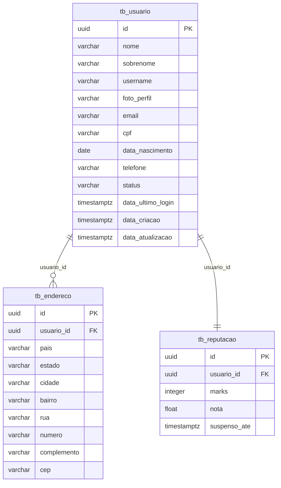

# User Service

Microsserviço responsável pelo gerenciamento de usuários da plataforma **O Leiloeiro Online**, abrangendo dados cadastrais, autenticação, reputação e eventos de domínio.


## 📋 Sobre o Projeto

O **User Service** é o microsserviço central para gestão de usuários. Ele é responsável por:

- ✅ **CRUD completo de usuários** (criação, consulta, atualização e desativação)
- ✅ **Integração com Keycloak** para gerenciamento de identidade
- ✅ **Reputação e penalidades** (suspensão, banimento, marks)
- ✅ **Eventos assíncronos** via Kafka (criação, deleção, penalidades)
- ✅ **Cache distribuído** com Redis
- ✅ **Upload de fotos de perfil** via S3
- ✅ **Métricas e monitoramento** com Actuator/Prometheus
- ✅ **Rastreamento distribuído** com Correlation ID


## 🏗️ Arquitetura

```
┌─────────────────────────────────────────────────────────────────┐
│                      API Gateway                               │
│                         localhost:9999                         │
└─────────────────────────────────────────────────────────────────┘
                              │
                              ▼
┌─────────────────────────────────────────────────────────────────┐
│                        User Service                            │
│                         localhost:8080                         │
├─────────────────────────────────────────────────────────────────┤
│  • CRUD de usuários                                           │
│  • Integração Keycloak                                        │
│  • Reputação e penalidades                                    │
│  • Eventos Kafka                                              │
│  • Cache Redis                                                │
│  • Upload S3                                                  │
│  • Métricas Prometheus                                        │
└─────────────────────────────────────────────────────────────────┘
          │               │               │
          ▼               ▼               ▼
┌───────────────┐ ┌───────────────┐ ┌───────────────┐
│   PostgreSQL  │ │     Redis     │ │    Keycloak   │
│   :5432       │ │   :6379       │ │   :8080       │
└───────────────┘ └───────────────┘ └───────────────┘
          │               │               │
          └───────────────┼───────────────┘
                          ▼
┌─────────────────────────────────────────────────────────────────┐
│                           Kafka                                │
│                         :9092                                  │
└─────────────────────────────────────────────────────────────────┘
```


## 🚀 Tecnologias Utilizadas

| Tecnologia | Versão | Descrição |
|------------|--------|-----------|
| **Spring Boot** | 4.0.6 | Framework principal |
| **Spring Security** | - | Autorização |
| **Spring Data JPA** | - | ORM e acesso a dados |
| **Spring Kafka** | - | Eventos assíncronos |
| **Keycloak** | 26.0.9 | Gerenciamento de usuários e autenticação |
| **PostgreSQL** | - | Banco de dados relacional |
| **Redis** | - | Cache distribuído |
| **Flyway** | - | Migrações de banco de dados |
| **AWS S3** | - | Armazenamento de imagens |
| **Micrometer** | - | Métricas e monitoramento |
| **Lombok** | - | Redução de boilerplate |
| **Java** | 25 | Linguagem |


## 📂 Estrutura do Projeto
```
src/main/java/com/br/infnet/userservice/
├── UserServiceApplication.java          # Classe principal
├── config/
│   ├── CacheConfig.java                 # Configuração Redis
│   ├── KafkaConfig.java                 # Configuração Kafka
│   ├── KeycloakConfig.java              # Configuração Keycloak
│   ├── S3Config.java                    # Configuração AWS S3
│   └── SecurityConfig.java              # Configuração de segurança
├── controller/
│   ├── UsuarioController.java           # Endpoints REST
│   └── TestEventController.java         # Endpoints de teste (dev)
├── domain/
│   ├── Usuario.java                     # Entidade principal
│   ├── Endereco.java                    # Entidade de endereço
│   └── Reputacao.java                   # Entidade de reputação
├── dto/
│   ├── UsuarioCreationRequest.java      # DTO de criação
│   ├── UsuarioProfileResponse.java      # DTO de perfil
│   ├── UsuarioStatusResponse.java       # DTO de status
│   └── events/                          # Eventos Kafka
│       ├── UserCreatedEvent.java
│       ├── UserDeletedEvent.java
│       ├── UserSuspendedEvent.java
│       └── UserBannedEvent.java
├── enums/
│   └── Status.java                      # Status do usuário
├── exceptions/                          # Exceções customizadas
├── filter/
│   └── CorrelationIdFilter.java         # Correlation ID
├── kafka/
│   ├── UserKafkaProducer.java           # Producer de eventos
│   └── UserKafkaConsumer.java           # Consumer de eventos
├── mapper/
│   ├── UsuarioMapper.java               # Mapper de entidades
│   └── UserEventMapper.java             # Mapper de eventos
├── penalty/
│   ├── PenaltyFactory.java              # Fábrica de penalidades
│   └── PenaltyStrategy.java             # Estratégias de penalidade
├── repository/
│   └── UsuarioRepository.java           # Repositório JPA
├── scheduler/
│   └── BackFromSuspensionScheduler.java # Agendador de reativação
├── service/
│   └── UsuarioService.java              # Lógica de negócio
├── storage/
│   └── BucketStorageService.java        # Serviço S3
└── utils/
    ├── CorrelationIdUtil.java           # Utilidade de Correlation ID
    └── UsernameGenerator.java           # Gerador de usernames
```


## 📌 Entidades do Domínio

### Usuario (`tb_usuario`)

Entidade principal que armazena os dados do usuário.

| Campo | Tipo | Descrição |
|-------|------|-----------|
| `id` | UUID | Identificador único do usuário |
| `nome` | String | Primeiro nome |
| `sobrenome` | String | Sobrenome |
| `username` | String | Nome de usuário (único) |
| `fotoPerfil` | String | URL da foto de perfil (S3) |
| `email` | String | Email (único) |
| `cpf` | String | CPF (único) |
| `dataNascimento` | LocalDate | Data de nascimento |
| `telefone` | String | Telefone para contato |
| `status` | Status | ATIVO, INATIVO, SUSPENSO, BANIDO |
| `dataUltimoLogin` | Instant | Último login |
| `dataCriacao` | Instant | Data de criação |
| `dataAtualizacao` | Instant | Data da última atualização |

### Endereco (`tb_endereco`)

Endereços associados ao usuário (1:N).

| Campo | Tipo | Descrição |
|-------|------|-----------|
| `id` | UUID | Identificador único |
| `usuario` | Usuario | Usuário dono do endereço |
| `pais` | String | País |
| `estado` | String | Estado |
| `cidade` | String | Cidade |
| `bairro` | String | Bairro |
| `rua` | String | Rua |
| `numero` | String | Número |
| `complemento` | String | Complemento |
| `cep` | String | CEP |

### Reputacao (`tb_reputacao`)

Sistema de reputação e penalidades (1:1).

| Campo | Tipo | Descrição |
|-------|------|-----------|
| `id` | UUID | Identificador único |
| `usuario` | Usuario | Usuário dono da reputação |
| `marks` | Integer | Pontuação de penalidade (inicia em 3) |
| `nota` | Float | Nota de reputação (0-5) |
| `suspensoAte` | Instant | Data de fim da suspensão |


## 🔀 Endpoints REST

**Base Path:** `/usuarios`

### Públicos (sem autenticação)

| Método | Endpoint | Descrição |
|--------|----------|-----------|
| `POST` | `/novo` | Cria um novo usuário |
| `GET` | `/listar-usernames` | Sugere usernames disponíveis |
| `GET` | `/{id}/perfil` | Busca perfil público do usuário |
| `GET` | `/{id}/seller-info` | Busca informações de vendedor |

### Privados (requer autenticação)

| Método | Endpoint | Descrição |
|--------|----------|-----------|
| `GET` | `/me` | Busca perfil do usuário autenticado |
| `PUT` | `/trocar-pfp` | Altera foto de perfil |
| `GET` | `/listar-pfps` | Lista fotos disponíveis no S3 |
| `DELETE` | `/deletar/{id}` | Desativa usuário (soft delete) |

### Internos (para outros microsserviços)

| Método | Endpoint | Descrição |
|--------|----------|-----------|
| `GET` | `/status` | Busca status de múltiplos usuários |
| `GET` | `/{id}` | Busca dados básicos do usuário |

### Testes (apenas perfil `dev`)

| Método | Endpoint | Descrição |
|--------|----------|-----------|
| `POST` | `/test/events/auction-report` | Dispara evento de report de leilão |
| `POST` | `/test/events/message-report` | Dispara evento de report de mensagem |
| `POST` | `/test/events/payment-failed` | Dispara evento de falha de pagamento |
| `POST` | `/test/scheduler/restore/{userId}` | Reativa usuário suspenso |
| `POST` | `/test/scheduler/run` | Executa scheduler manualmente |
| `GET` | `/test/scheduler/suspended` | Lista usuários suspensos |


## 🔄 Eventos Kafka

### Produzidos pelo User Service

| Evento | Tópico | Descrição |
|--------|--------|-----------|
| `UserCreatedEvent` | `user.created` | Novo usuário criado |
| `UserDeletedEvent` | `user.deleted` | Usuário desativado |
| `UserSuspendedEvent` | `user.suspended` | Usuário suspenso |
| `UserBannedEvent` | `user.banned` | Usuário banido |

### Consumidos pelo User Service

| Evento | Tópico | Descrição |
|--------|--------|-----------|
| `AuctionReportApprovedEvent` | `reviews.report.auction-approved` | Report de leilão aprovado |
| `MessageReportApprovedEvent` | `reviews.report.qa-approved` | Report de mensagem aprovado |
| `PaymentFailedEvent` | `transactions.status.closed` | Falha de pagamento |

---

## 🗄️ Esquema do Banco de Dados

Todas as tabelas são gerenciadas via **Flyway** e isoladas no schema `usuarios`.




## 🚀 Como Executar

### Com Docker Compose

> 💡 Atenção! Para o user-service funcionar completamente, é necessário subir primeiro o message-broker presente na organização e depois o observabilidade. Aí sim depois você pode subir o user-service.

```bash
# Subir o serviço
docker-compose up -d

# Ver logs
docker-compose logs -f user-service

# Parar
docker-compose down

# Parar e remover volumes
docker-compose down -v
```

---

## 📊 Métricas e Monitoramento

### Endpoints Actuator

| Endpoint | Descrição |
|----------|-----------|
| `/actuator/health` | Health check |
| `/actuator/info` | Informações da aplicação |
| `/actuator/metrics` | Métricas da aplicação |
| `/actuator/prometheus` | Métricas no formato Prometheus |

### Métricas Customizadas

| Métrica | Descrição |
|---------|-----------|
| `users.created.total` | Total de usuários criados |
|`users.suspended.total` | Total de usuários suspensos | 
| `users.deleted.total` | Total de usuários desativados |
| `users.banned.total` | Total de usuários banidos |

---

## 🧪 Testando o Serviço

### Criar usuário

```bash
curl -X POST http://localhost:8080/usuarios/novo \
  -H "Content-Type: application/json" \
  -d '{
  "nome": "Ricardo",
  "sobrenome": "Oliveira",
  "email": "ricardo_oliveira@email.com",
  "cpf": "12345678909",
  "dataNascimento": "1990-05-20",
  "telefone": "11988887777",
  "username": "ricardoouro37",
  "senha": "SenhaForte@123",
  "enderecos": [
    {
      "pais": "Brasil",
      "estado": "SP",
      "cidade": "São Paulo",
      "bairro": "Pinheiros",
      "rua": "Rua das Flores",
      "numero": "100",
      "cep": "05422-000"
    }
  ]
}'
```

### Buscar perfil

```bash
curl http://localhost:8080/usuarios/{id}/perfil
```

### Buscar perfil do usuário autenticado

```bash
curl -X GET http://localhost:8080/usuarios/me \
  -H "X-User-Id: {user-uuid}"
```

### Disparar evento de teste

```bash
curl -X POST "http://localhost:8080/test/events/auction-report?userId={uuid}&reason=Teste"
```

---

## 🔒 Segurança

- **JWT**: Validado via Keycloak (Resource Server)
- **Sessão**: Via Gateway (cookie JSESSIONID)
- **Headers Internos**: `X-User-Id` para identificação de usuário autenticado
- **Correlation ID**: Rastreamento distribuído via `X-Correlation-Id`

---

## 📝 Licença

Este projeto é parte do ecossistema **O Leiloeiro Online**.

---

## 👥 Contribuidores

- Larissa Conti - desenvolvedora principal deste microsserviço
