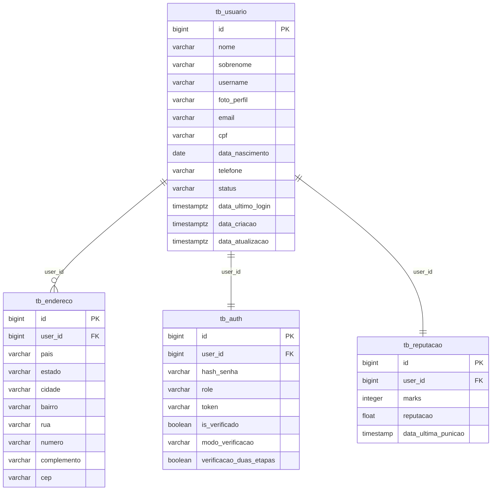

# User Service

Microsserviço responsável pelo gerenciamento de usuários da aplicação de leilão, abrangendo dados cadastrais, autenticação, endereços físicos e métricas de reputação. Construído com **Spring Boot**, **PostgreSQL** e **Docker**.

## 📌 Entidades do Domínio

A arquitetura do domínio gira em torno da entidade central `Usuario`, que possui relacionamentos diretos com domínios adjacentes:

* **Usuario (`tb_usuario`)**: Entidade Mestre. Armazena informações PII (Personally Identifiable Information) como nome, documento, e-mail e dados de contato.
* **Endereco (`tb_endereco`)**: Entidade Filha (1:N). Guarda os registros de endereço atrelados a um usuário, viabilizando o cadastro de múltiplos endereços (casa, trabalho, etc).
* **Auth (`tb_auth`)**: Entidade Relacional (1:1). Isola as responsabilidades de segurança. Mantém hash de senhas, JWT tokens, roles da aplicação e estado do Multi-Factor Auth (MFA/Verificação 2 etapas).
* **Reputacao (`tb_reputacao`)**: Entidade Relacional (1:1). Isola a engine de gamificação e punições do usuário, documentando marcas (marks), score e data da última penalidade.

## 🔀 Endpoints (REST API)

Atualmente mapeados e disponibilizados (base path: `/usuarios`):

* `GET /usuarios` 
  * Retorna uma lista com os usuários do sistema.
* `GET /usuarios/{id}` 
  * Retorna o payload detalhado de um usuário específico, resgatando seus agregados configurados via DTO.

*(Endpoints de persistência e deleção como `POST /usuarios`, `PUT /usuarios/{id}` e `DELETE /usuarios/{id}` podem ser incluídos nesta mesma arquitetura seguindo os Controllers).*

## 🗄️ Esquema do Banco de Dados

Todas as tabelas são gerenciadas via migrações estritas do **Flyway** e isoladas dentro do schema `usuarios`. 

Abaixo encontra-se a modelagem das tabelas do banco de dados:


## 🚀 Infraestrutura Local

O microsserviço requer o banco de dados rodando em background. A estrutura está contida no arquivo `docker-compose.yaml`.

Para iniciar o banco isolado de forma limpa (destruindo volumes antigos):
```bash
docker-compose down -v
docker-compose up -d
```
Após executar os comandos acima, a API Spring Boot construirá o contexto e as migrações serão validadas com sucesso.
